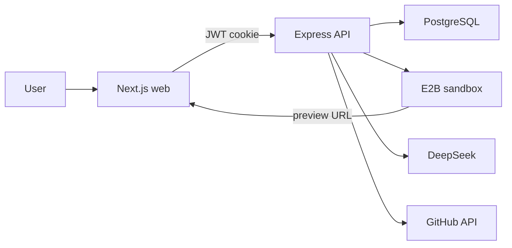

<p align="center">
  
</p>

<p align="center">
  
</p>

<h1 align="center">Zuno</h1>

<p align="center">
  <strong>Prompt. Preview. Ship.</strong><br />
  You do not need a developer team to bring an idea to life. Full-stack AI website builder with live E2B preview, iterate, push to GitHub, and publish with a live link.
</p>

<p align="center">
  <a href="https://zuno.ashishjha.xyz">
    
  </a>
  &nbsp;
  <a href="https://github.com/ashishxjhaa/Zuno">
    
  </a>
  &nbsp;
  <a href="https://github.com/ashishxjhaa/Zuno">
    
  </a>
  &nbsp;
  <a href="https://github.com/ashishxjhaa/Zuno/issues">
    
  </a>
</p>

<p align="center">
  
  
  
  
  
  
  
  
</p>

<p align="center">
  <a href="https://zuno.ashishjha.xyz"><strong>Live Demo</strong></a>
  ·
  <a href="#features"><strong>Features</strong></a>
  ·
  <a href="#getting-started"><strong>Getting Started</strong></a>
  ·
  <a href="#architecture"><strong>Architecture</strong></a>
  ·
  <a href="https://ashishjha.xyz/"><strong>Author</strong></a>
</p>

---

## Why Zuno?

Most AI builders dump a zip and leave you guessing. Zuno keeps you in a **conversational builder** with a **real live preview** in an E2B sandbox. You clarify, pick a stack, watch the site generate, then ship edits by talking - no drag-and-drop canvas required.

Built as a full-stack + AI portfolio product: auth, projects, sandboxes, publish, GitHub push, and codebase download.

---

## Features

| | |
| :--- | :--- |
| **Prompt to live site** | Clarify in chat, choose React or Next (JS or TS), and DeepSeek builds a complete Tailwind site. |
| **Live sandbox preview** | The builder iframe is a real E2B Vite/Next URL. Watch the site come together as files land. |
| **Conversational edits** | Change the site by talking. The model uses `readFile`, `writeFile`, `updateFile`, and `deleteFile`. |
| **Stack choice** | Vite + React or Next.js, JavaScript or TypeScript, with prebaked E2B templates for fast first paint. |
| **Push to GitHub** | Connect GitHub OAuth, create or link a repo, and push the generated source from the sandbox. |
| **Download codebase** | Export a source `.zip` (no `node_modules`) from the Download tab. |
| **Publish** | Keep a preview online. Unpublished projects go idle after 30 minutes and are cleaned up. |
| **Auth** | Email signup/signin with JWT httpOnly cookies and bcrypt-hashed passwords. |

---

## Screenshots

<p align="center">
  
  <em>Landing - prompt box, stack pickers, and orange product UI</em>
</p>

<p align="center">
  
  <em>Features - what Zuno ships out of the box</em>
</p>

<p align="center">
  
  <em>Idea to life - from a single prompt to a working site</em>
</p>

<table>
  <tr>
    <td width="50%" align="center">
      
      <p><em>Sign in</em></p>
    </td>
    <td width="50%" align="center">
      
      <p><em>Sign up</em></p>
    </td>
  </tr>
</table>

---

## Tech Stack

| Layer | Stack |
| :--- | :--- |
| **Web** | Next.js 16 (App Router), React 19, Tailwind CSS 4, Motion |
| **API** | Bun + Express 5, Zod validation, JWT cookies |
| **Data** | Prisma 7, PostgreSQL (Neon or local `pg`) |
| **Sandboxes** | E2B (Vite React + Next templates, JS/TS) |
| **AI** | DeepSeek (site generation + chat tools) |
| **Export** | GitHub OAuth + Octokit push, JSZip download |
| **Monorepo** | Turborepo + Bun workspaces |

---

## Architecture

```text
Zuno/
├── apps/
│   ├── web/       # Next.js frontend  → :3000  (Vercel)
│   └── server/    # Bun + Express API → :4000  (EC2 Docker)
├── packages/
│   └── ui/        # Shared UI primitives
├── docs/images/   # README screenshots
├── Dockerfile     # Server-only image for EC2
└── package.json
```

| Service | Role | Deploy |
| :--- | :--- | :--- |
| `apps/web` | Landing, auth, builder (preview, code, chat, GitHub, download) | Vercel |
| `apps/server` | REST API, Prisma, E2B, DeepSeek, GitHub OAuth, idle reaper | EC2 (Docker) |



1. **Create** - `POST /api/v1/project` inserts the project and returns `{ id }` immediately. Sandbox + DeepSeek run in the background.
2. **Builder** - polls project state, iframes the E2B preview, and sends chat to `/conversation`. The morph overlay stays until generation finishes.
3. **Idle** - the open tab sends a heartbeat. After 30 minutes with no heartbeat, unpublished projects are killed and deleted.
4. **Publish / export** - publish keeps the preview online; GitHub push and `.zip` download export the sandbox source.

Project files live in the sandbox. Postgres stores users, project metadata, and chat.

---

## Getting Started

### Prerequisites

- [Bun](https://bun.sh) `>= 1.3`
- Node.js `>= 20`
- PostgreSQL (local, Docker, or [Neon](https://neon.tech))
- [E2B](https://e2b.dev) API key
- [DeepSeek](https://platform.deepseek.com) API key
- Optional: GitHub OAuth App (Push to GitHub), AWS S3 if you use related uploads

### Install

```bash
git clone https://github.com/ashishxjhaa/Zuno.git
cd Zuno
bun install
```

### Environment

```bash
cp apps/server/.env.example apps/server/.env
cp apps/web/.env.example apps/web/.env
```

Fill in the values (see [Environment Variables](#environment-variables)).

### Database

```bash
cd apps/server && bunx prisma migrate dev
```

### Run locally

```bash
# from repo root
bun run dev
```

Or separately:

```bash
cd apps/server && bun run dev   # http://localhost:4000
cd apps/web && bun run dev      # http://localhost:3000
```

Open [http://localhost:3000](http://localhost:3000).

### Docker (API on EC2)

Build the **server-only** image from the repo root (frontend stays on Vercel):

```bash
docker build -t zuno-api .
docker run --env-file apps/server/.env -p 4000:4000 zuno-api
```

Or with context `apps/server`:

```bash
docker build -t zuno-api -f apps/server/Dockerfile apps/server
```

---

## Environment Variables

### `apps/server/.env`

| Variable | Required | Purpose |
| :--- | :--- | :--- |
| `DATABASE_URL` | Yes | Postgres connection string |
| `JWT_SECRET` | Yes | Auth token signing |
| `FRONTEND_URL` | Yes | Web origin (`http://localhost:3000` locally; production Vercel URL, no trailing slash) |
| `E2B_API_KEY` | Yes | E2B sandbox API key |
| `DEEPSEEK_API_KEY` | Yes | DeepSeek API key |
| `PORT` | No | API port (default `4000`) |
| `E2B_TEMPLATE_REACT_TS` / `_JS` / `NEXT_TS` / `NEXT_JS` | Prod speed | Prebaked template aliases |
| `GITHUB_CLIENT_ID` | GitHub push | OAuth App client ID |
| `GITHUB_CLIENT_SECRET` | GitHub push | OAuth App client secret |
| `GITHUB_CALLBACK_URL` | GitHub push | Must match OAuth callback, e.g. `http://localhost:4000/api/v1/github/oauth/callback` |

### `apps/web/.env`

| Variable | Required | Purpose |
| :--- | :--- | :--- |
| `NEXT_PUBLIC_API_URL` | Yes | API origin only (e.g. `http://localhost:4000`). Do not append `/api/v1` |

---

## Scripts

| Command | Description |
| :--- | :--- |
| `bun run dev` | Start web + server via Turborepo |
| `bun run build` | Production build across the monorepo |
| `bun run lint` | Lint all packages |
| `bun run typecheck` | Typecheck all packages |
| `cd apps/server && bun run dev` | API on port 4000 |
| `cd apps/web && bun run dev` | Next.js on port 3000 |
| `cd apps/server && bunx prisma migrate dev` | Apply migrations |

---

## Routes

| Route | Auth | Description |
| :--- | :--- | :--- |
| `/` | Public | Landing page |
| `/signin` | Public | Sign in |
| `/signup` | Public | Create an account |
| `/projects/:id` | Required | Preview, code, chat, GitHub, download |

---

## API

Auth is under `/api/v1/auth`. Projects are under `/api/v1/project`. Project routes require a session cookie.

| Method | Path | Body |
| :--- | :--- | :--- |
| `POST` | `/api/v1/auth/signup` | `{ name, email, password }` |
| `POST` | `/api/v1/auth/signin` | `{ email, password }` |
| `POST` | `/api/v1/auth/signout` | (none) |
| `GET` | `/api/v1/auth/me` | (none) |
| `POST` | `/api/v1/project` | `{ initialPrompt }` |
| `GET` | `/api/v1/project/:id` | (none) |
| `POST` | `/api/v1/project/:id/conversation` | `{ contents }` |
| `POST` | `/api/v1/project/:id/heartbeat` | (none) |
| `POST` | `/api/v1/project/:id/publish` | (none) |
| `GET` | `/api/v1/project/:id/download` | (none) - source zip |

GitHub OAuth + push live under `/api/v1/github/*` (connect popup, link repo, push from sandbox).

---

## Deployment

**Do not deploy `apps/server` on Vercel.** The API is a long-running Bun + Express process (background E2B builds, idle reaper, `app.listen`). Vercel serverless will fail at runtime.

| App | Host | Notes |
| :--- | :--- | :--- |
| `apps/web` | **Vercel** | Root Directory `apps/web`. Set `NEXT_PUBLIC_API_URL` to the public API origin. |
| `apps/server` | **EC2 (Docker)** | Use the root `Dockerfile` (server only). Set env vars, run `prisma migrate deploy`, expose `:4000`. |

Production checklist:

1. Set `FRONTEND_URL` on the API to the exact Vercel origin (no trailing slash).
2. Set `NEXT_PUBLIC_API_URL` on Vercel to the EC2 API origin (no `/api/v1`), then **redeploy web** (it is inlined at build time).
3. Auth cookies use `SameSite=None; Secure` in production so the Vercel site can call the API with credentials.
4. Point the GitHub OAuth callback at `https://<api-host>/api/v1/github/oauth/callback`.

Live site: [https://zuno.ashishjha.xyz](https://zuno.ashishjha.xyz)

---

## Author

**Ashish Jha**

<p>
  <a href="https://ashishjha.xyz/">
    
  </a>
  &nbsp;
  <a href="https://github.com/ashishxjhaa">
    
  </a>
  &nbsp;
  <a href="https://x.com/ashishxjha">
    
  </a>
  &nbsp;
  <a href="https://www.linkedin.com/in/ashishxjha/">
    
  </a>
</p>

---

<p align="center">
  <a href="https://zuno.ashishjha.xyz">
    
  </a>
</p>
