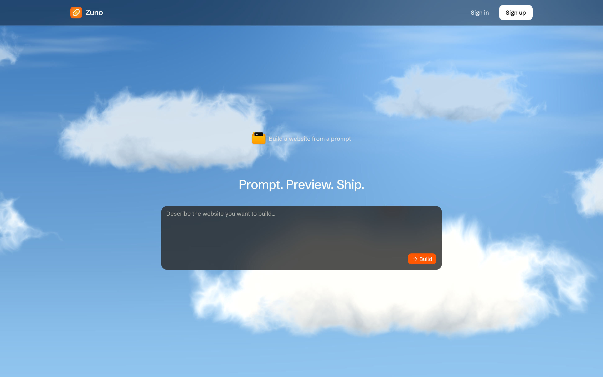
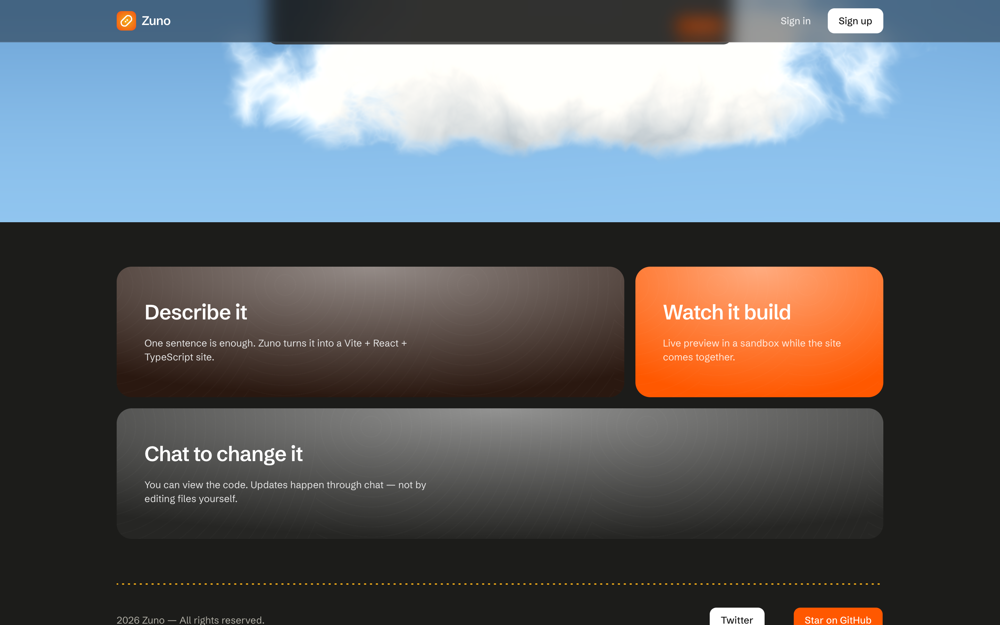
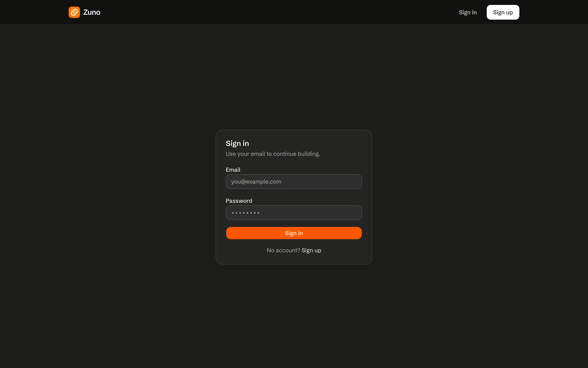
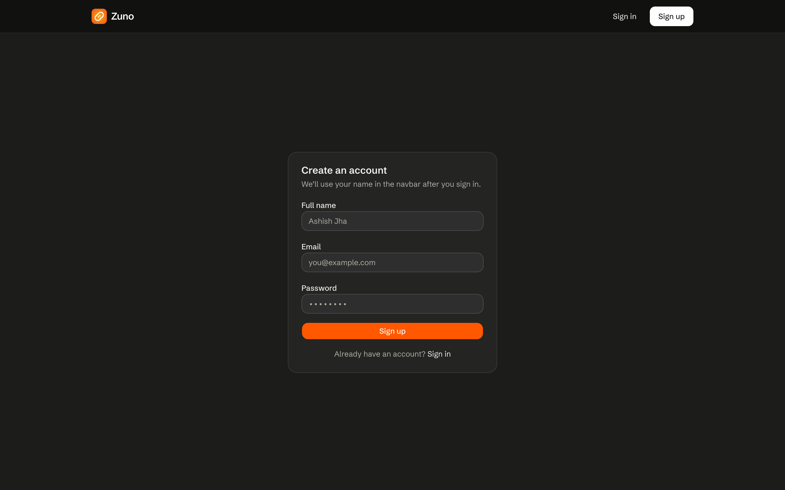
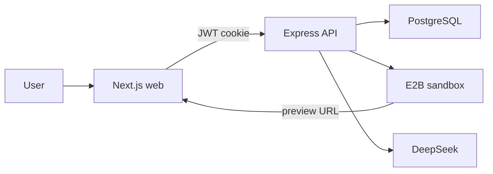

<div align="center">


# Zuno

**Prompt. Preview. Ship.**

A chat-only AI website builder. Clarify in chat, pick React or Next with JS or TS, get a live sandbox preview, then iterate in chat.

[](https://zuno-web.vercel.app)
[](https://github.com/ashishxjhaa/Zuno/stargazers)
[](https://github.com/ashishxjhaa/Zuno/network/members)
[](https://github.com/ashishxjhaa/Zuno/issues)

[Live Demo](https://zuno-web.vercel.app) · [Report Bug](https://github.com/ashishxjhaa/Zuno/issues) · [Request Feature](https://github.com/ashishxjhaa/Zuno/issues)

</div>

---

## Preview

<table>
  <tr>
    <td align="center"><strong>Landing</strong></td>
    <td align="center"><strong>Features</strong></td>
  </tr>
  <tr>
    <td></td>
    <td></td>
  </tr>
  <tr>
    <td align="center"><strong>Sign In</strong></td>
    <td align="center"><strong>Sign Up</strong></td>
  </tr>
  <tr>
    <td></td>
    <td></td>
  </tr>
</table>

## Features

- **Prompt to live site**: clarify, pick your stack (React/Next, JS/TS), then DeepSeek builds a complete Tailwind site
- **Live sandbox preview**: the builder iframe is the real E2B Vite URL. You watch the site come together
- **Chat-only edits**: view the code, change the site by talking. The model uses `readFile`, `writeFile`, `updateFile`, and `deleteFile`
- **Publish**: keep a preview online. Unpublished projects go idle after 30 minutes and are deleted
- **Authentication**: signup, signin, JWT in httpOnly cookies with bcrypt-hashed passwords
- **Dark product UI**: cloud-shader landing, orange accent (`#ff5800`), and a builder with preview, code, and chat

## Tech Stack

Built with Next.js 16, React 19, TypeScript, Tailwind CSS 4, Express 5, Prisma 7, PostgreSQL, E2B, DeepSeek, Turborepo, and Bun.

<div align="center">


</div>

## Getting Started

### Prerequisites

- [Bun](https://bun.sh/) 1.3+ (recommended) or Node.js 20+
- PostgreSQL database ([Neon](https://neon.tech/) recommended)
- [E2B](https://e2b.dev) API key
- [DeepSeek](https://platform.deepseek.com) API key

### Installation

```bash
git clone https://github.com/ashishxjhaa/Zuno.git
cd Zuno
bun install
```

Copy the example env files and fill in your values (see [Environment Variables](#environment-variables)):

```bash
cp apps/server/.env.example apps/server/.env
cp apps/web/.env.example apps/web/.env
```

Migrate the database, then start both apps:

```bash
cd apps/server && bunx prisma migrate dev && bun run dev
```

```bash
cd apps/web && bun run dev
```

Open [http://localhost:3000](http://localhost:3000) in your browser.

> **Note:** `npm`, `yarn`, and `pnpm` also work. Replace `bun` / `bunx` with your package manager of choice.

## Environment Variables

### `apps/server/.env`

| Variable | Required | Description |
|----------|----------|-------------|
| `DATABASE_URL` | Yes | PostgreSQL connection string (Neon recommended) |
| `JWT_SECRET` | Yes | Secret for signing and verifying JWT tokens |
| `FRONTEND_URL` | Yes | Web origin, e.g. `http://localhost:3000` locally |
| `E2B_API_KEY` | Yes | E2B sandbox API key |
| `DEEPSEEK_API_KEY` | Yes | DeepSeek API key (`https://api.deepseek.com`) |
| `PORT` | No | API port (default `4000`) |

### `apps/web/.env`

| Variable | Required | Description |
|----------|----------|-------------|
| `NEXT_PUBLIC_API_URL` | Yes | API origin, e.g. `http://localhost:4000` locally. Do not append `/api/v1` |

## Scripts

| Command | Description |
|---------|-------------|
| `bun run dev` | Start all apps via Turborepo |
| `bun run build` | Production build across the monorepo |
| `bun run lint` | Run ESLint |
| `bun run typecheck` | Run TypeScript checks |
| `cd apps/server && bun run dev` | Start the Express API on port 4000 |
| `cd apps/web && bun run dev` | Start the Next.js app on port 3000 |

## Project Structure

```
Zuno/
├── apps/
│   ├── web/              # Next.js landing, auth, and builder
│   └── server/           # Express API, Prisma, E2B, DeepSeek
│       └── templates/    # Vite + React + TypeScript sandbox starter
├── packages/
│   └── ui/               # Shared UI primitives
├── docs/screenshots/     # README preview images
└── Dockerfile            # Server-only image for Railway / Render / Fly
```

## Routes

| Route | Auth | Description |
|-------|------|-------------|
| `/` | Public | Landing page |
| `/signin` | Public | Sign in |
| `/signup` | Public | Create an account |
| `/builder/:id` | Required | Preview, code, and chat for a project |

## API

Auth is under `/api/v1/auth`. Projects are under `/api/v1/project`. All project routes require a session cookie.

| Method | Path | Body |
|--------|------|------|
| `POST` | `/api/v1/auth/signup` | `{ name, email, password }` |
| `POST` | `/api/v1/auth/signin` | `{ email, password }` |
| `POST` | `/api/v1/auth/signout` | (none) |
| `GET` | `/api/v1/auth/me` | (none) |
| `POST` | `/api/v1/project` | `{ initialPrompt }` |
| `GET` | `/api/v1/project/:id` | (none) |
| `POST` | `/api/v1/project/:id/conversation` | `{ contents }` |
| `POST` | `/api/v1/project/:id/heartbeat` | (none) |
| `POST` | `/api/v1/project/:id/publish` | (none) |

`POST /api/v1/project` returns `{ id }` as soon as the row is inserted. Generation is not awaited. You land on `/builder/{id}` immediately; the overlay stays until the sandbox and DeepSeek finish.

## Architecture



1. **Build**: `POST /api/v1/project` creates the project. Sandbox + DeepSeek run in the background.
2. **Builder**: polls project state, iframes the E2B preview, and sends chat to `/conversation`.
3. **Idle**: the open tab sends a heartbeat. After 30 minutes with no heartbeat, unpublished projects are killed and deleted.
4. **Publish**: `POST /api/v1/project/:id/publish` returns `{ url }`. Published projects are not idle-deleted.

Project files live in the sandbox. Postgres stores users, project metadata, and chat. There is no S3.

## Deployment

**Do not deploy `apps/server` on Vercel.** The API is a long-running Bun + Express process (background E2B builds, idle reaper, `app.listen`). Vercel serverless will fail at runtime.

| App | Host | Live |
|-----|------|------|
| `apps/web` (Next.js) | Vercel | [zuno-web.vercel.app](https://zuno-web.vercel.app) |
| `apps/server` (Express) | Railway, Render, or Fly.io | Root `Dockerfile` |

### API (Railway)

1. New Railway project from this GitHub repo (leave Root Directory empty / repo root).
2. Uses the root `Dockerfile` (copies **only** `apps/server`).
3. Set `DATABASE_URL`, `JWT_SECRET`, `FRONTEND_URL` (exact Vercel URL, no trailing slash), `E2B_API_KEY`, `DEEPSEEK_API_KEY`, and `NODE_ENV=production`.
4. Set `NEXT_PUBLIC_API_URL` on Vercel to the Railway origin only. Do not append `/api/v1`.
5. Migrate once: `cd apps/server && bunx prisma migrate deploy`.

Auth cookies use `SameSite=None; Secure` in production so the Vercel site can call the Railway API with credentials. After changing `NEXT_PUBLIC_API_URL`, **redeploy the web app** (it is inlined at build time).

### Web (Vercel)

Deploy `apps/web` with Root Directory `apps/web`. Set `NEXT_PUBLIC_API_URL` to the Railway API URL.

## Author

**Ashish** · [GitHub](https://github.com/ashishxjhaa)

---
